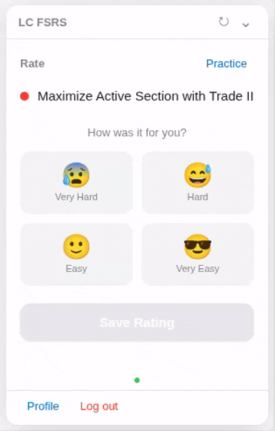

# AlgoSRS

[](https://github.com/omarzayedbeshir/lc-fsrs/actions/workflows/ci.yml)
[](https://go.dev)
[](https://www.typescriptlang.org/)
[](LICENSE)

A Chrome extension that uses the [FSRS](https://github.com/open-spaced-repetition/ts-fsrs) spaced-repetition algorithm — the same scheduler powering Anki — to help LeetCode users systematically review and retain problem-solving skills. Save problems with a rating, review on an FSRS-optimized schedule, and sync across devices.

## Demo

<p align="center">
  
</p>

**Stack**: WXT / React 18 / Go 1.22 + stdlib / PostgreSQL (pgx v5) / Supabase Auth / ts-fsrs v5 / Railway

## Architecture

```
Extension (Popup + Content Script + Background)
    │                          │
    │ JWT (api calls)          │ PKCE (auth)
    ▼                          ▼
Go Backend (Railway)      Supabase Auth
    │
    │ pgx pool
    ▼
PostgreSQL
```

Data flows local-first: entries are written to `chrome.storage.local` immediately for instant UI, then synced to the backend. Review scheduling is computed client-side via `ts-fsrs`. The background script syncs every 30 minutes and on auth state changes.

## Key Engineering Decisions

**Local-first with server sync.** All CRUD reads from `chrome.storage.local` — no loading spinners. Save and Review panels additionally `POST /api/entries` immediately for durability. Background sync merges on URL identity with newer-`date`-wins conflict resolution. Offline-capable by design.

**Why Go for the backend.** Two external dependencies (`pgx`, `golang-jwt`). Single binary, ~200ms cold start on Railway's free tier. Go 1.22 `http.ServeMux` supports method-based routing (`mux.Handle("POST /api/entries", ...)`) natively — no framework needed for 8 routes. JWKS caching with 10-minute TTL for Supabase token verification.

**Supabase Auth in a Chrome extension.** Standard PKCE assumes a web app that can receive OAuth redirects. In an extension, we provide a custom `SupportedStorage` adapter backed by `chrome.storage.local` so the session persists across popup lifetimes. Password reset uses the implicit flow (`POST /auth/v1/recover` directly from the extension); our Go backend serves a client-side JS page at `/auth/callback` that reads `#access_token=xxx&type=recovery` from the URL hash and renders an inline reset form.

## Project Structure

```
src/
├── entrypoints/          # background.ts (auth msg handler, periodic sync)
│   │                     # content.tsx (injected on leetcode.com)
│   └── popup/            # App.tsx + main.tsx + style.css
├── components/           # AuthPanel, SavePanel, ReviewPanel,
│                         # PracticeList, ProfilePanel, WidgetApp
└── lib/                  # api-client, fsrs (scheduler wrapper),
                          # supabase (chrome.storage adapter), sync
backend/
├── main.go               # HTTP router (8 endpoints)
├── handler/entries.go    # All request handlers + password reset HTML page
├── middleware/            # JWT auth, CORS, JWKS cache
├── db/postgres.go        # pgx connection pool
├── db/schema.sql         # DDL
└── models/entry.go       # Entry, SyncRequest, SyncResponse
```

## Getting Started

```bash
npm install && npx wxt prepare
cp .env.example .env && cp backend/.env.example backend/.env

# Start Postgres and run schema
docker compose up -d db

# Start the backend
cd backend && go run .        # Backend on :8080

# Start the extension dev server (in another terminal)
cd .. && npm run dev           # Chrome with extension loaded
```

## Testing

```bash
# Frontend unit tests
npm test

# Backend tests (requires DATABASE_URL for integration tests)
cd backend && go test ./...

# Lint
npm run lint
npm run format:check
cd backend && golangci-lint run
```

## API

| Method | Path | Auth | Description |
|---|---|---|---|
| `GET` | `/api/health` | No | Health check |
| `GET` | `/auth/callback` | No | Password reset form page |
| `GET` | `/api/entries` | JWT | List entries |
| `POST` | `/api/entries` | JWT | Upsert entry |
| `DELETE` | `/api/entries` | JWT | Delete entry by `?id=` |
| `DELETE` | `/api/user/entries` | JWT | Delete all entries |
| `DELETE` | `/api/user` | JWT | Delete account + entries |
| `POST` | `/api/sync` | JWT | Bulk sync |

## Deployment

```bash
railway up                    # Backend (Dockerfile-based)
npm run build                 # Extension → output/chrome-mv3/
# Load unpacked from chrome://extensions
```

## Chrome Web Store (planned)

**Extension name:** AlgoSRS — Spaced Repetition for LeetCode

**Short description:** Save LeetCode problems with FSRS ratings and review on an optimized schedule. Syncs across devices.

**Category:** Productivity / Developer Tools

**Screenshots:** See [`screenshots/`](screenshots/placeholder.md) for the planned capture list.
